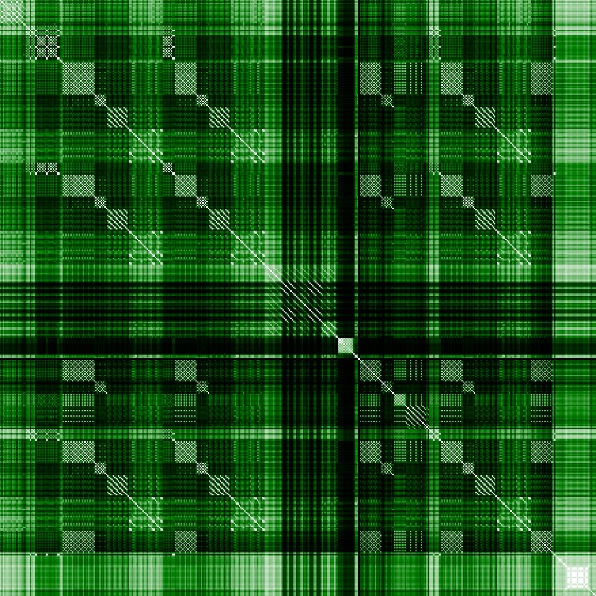

# Music patterns

This project is able to download songs online, transform them into matrices of similarity and compute statistics on the resulting images.

The code present here was used in the article [Similarity of structures in popular music](https://www.math.mcgill.ca/bcorsini/math/articles/similarity_of_structures_in_popular_music.pdf).

## Getting started

### Running the code

The library requirements for this code can be found in `requirements.txt`. To install them, run the following command line in the terminal:
```sh
pip install -r requirements.txt
```
Once this is done, or if the required libraries are already installed, run the following:
```sh
python main.py
```
This line will run the music pattern algorithm on the tablatures available in `data/tablatures/` (it should take about 5 minutes).

### Organization of the code

The code of this project is able to execute several tasks:
* It can scroll through [Ultimate Guitar](https://www.ultimate-guitar.com/) and download the specified songs (when available). The code for this task can be found in `scroller.py`.
* It can transform songs from _GuitarPro_ format to pattern matrices and images. The code for this task uses `song.py`, which transforms a song into a pattern matrix, and `patterns.py`, which saves these pattern matrices and transforms them into images.
* It can compute the distance between songs using their pattern matrices. The code for this task can be found in `measures.py`.
* It can use the distance between songs to group them into either clusters or neighbourhoods. The code for this task can be found in `grouping.py`.
* It can find relations between pattern structures and features. The code for this task can be found in `statistics.py`

On top of these files, `utils.py` contains a few useful functions and `main.py` wraps all the functions in one file.

### Running the different files

On top of `main.py` which combines all algorithms together, each file ending with `.py` (apart from `utils.py` and `song.py`) can be run independently. For example, if you are only interested in transforming your favorite songs into their corresponding images, you can place them in a new folder `my_tablatures/` and run the following command line:
```sh
python patterns.py --tab_dir my_tablatures --im_dir my_images --colour green
```
This will transforms the songs in `my_tablatures/` into images and save these images in `my_images/`. The parameter `--colour` can be used to choose the colour of the images and the set of choices can be found in `patterns.py`.

### Website scroller

The code in `scroller.py` is used to scroll through [Ultimate Guitar](https://www.ultimate-guitar.com/) and to download the corresponding files. This code requires you to set up a web driver for Chrome. To download the Chrome driver, go to [this webpage](https://chromedriver.chromium.org/downloads) and follow the instructions. Once you have downloaded the chromedriver, you can either put it in the main directory, or specify its path by using the argument `--chromedriver` in `scroller.py`.

__Disclaimer__: the code in `scroller.py` is very dependent on the architecture of the website it scrolls through. It might not be up-to-date with the current organization of the website and might need to be slightly modified. If it does not work, you can always manually download the tablatures from the website and put them into the tablature folder.

## The dataset

### Background

This repo contains a newly created dataset made of 4166 songs. Theese songs were downloaded using [this dataset](https://data.world/kcmillersean/billboard-hot-100-1958-2017) which contains the list of all songs that reached the _Billboard hot chart_. Each song is characterized by a _GuitarPro_ file and a set of 6 features: __artist__, __title__, __year__, __decade__, __genre__, and __types__. This dataset is useful to study music properties of a large set of popular songs.

### Reproducing the results of the article

The file `dataset/run.py` contains all the parameters used for the experiments in the article. To reproduce the these experiments, simply run:
```sh
python dataset/run.py
```
__Careful__, it will take about (40min + ) hours for the whole algorithm to be done.

### Playing with the dataset

If not interested in running the whole algorithm, the distance matrix and the images are already precomputed in `precomputed/`. To experiment with statistical properties of this dataset, use the file `precomputed/playing.py` by running:
```sh
python precomputed/playing.py
```
This file also accepts extra arguments and I invite the reader to experiment with the different clustering algorithms to appreciate the properties of this dataset, and the relations between features and structures.

## Results

This project produces two main types of results: image representation of songs, and statistics on a set of songs.

### Representation of songs

This project transforms songs into corresponding _pattern similarity matrices_. These matrices offer interesting representation of songs, where the structure of the song can usually be read from the image. Typical images look like the following.

<p align="center">
    
    <br />
    
</p>

### Statistics on patterns of songs

By using these images and comparing them between each other, it becomes possible to define a distance on songs based on pattern similarity. By combining this distance with information on the songs (such as artist, year, or genre), it is possible to obtain figures such as the following.

All figures created by this algorithm look like the one above: the horizontal axis corresponds to groups of songs and the vertical axis corresponds to some metric on these groups. The blue dots and blue bars represent the main subject of interest (here the year of release of the songs). The red bars usually give extra information on these groups (here the average distance between songs). Finally, the yellow stars represent a special element of this group of songs (here the center of the neighbourhood). More information on these figures and various types of results can be find in the [article](https://www.math.mcgill.ca/bcorsini/math/articles/similarity_of_structures_in_popular_music.pdf).

## Contact and information

If you have any questions regarding the code, feel free to contact me at <benoitcorsini@gmail.com>.

If you found this code useful or used it for your own study, please cite the following paper:
...